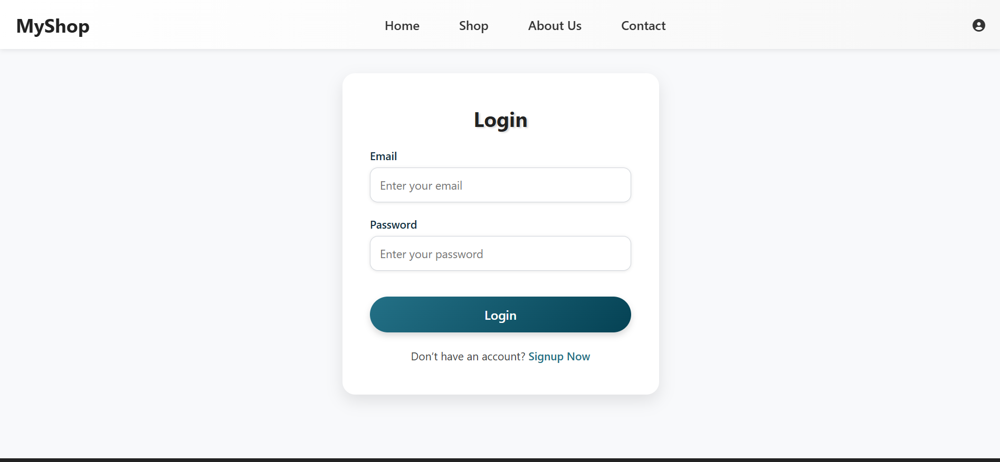
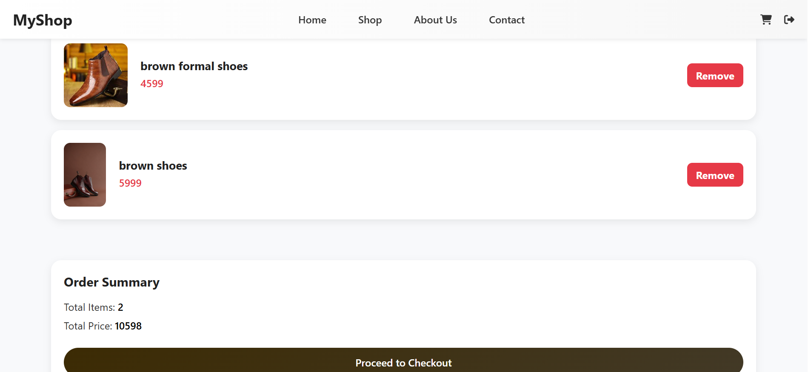
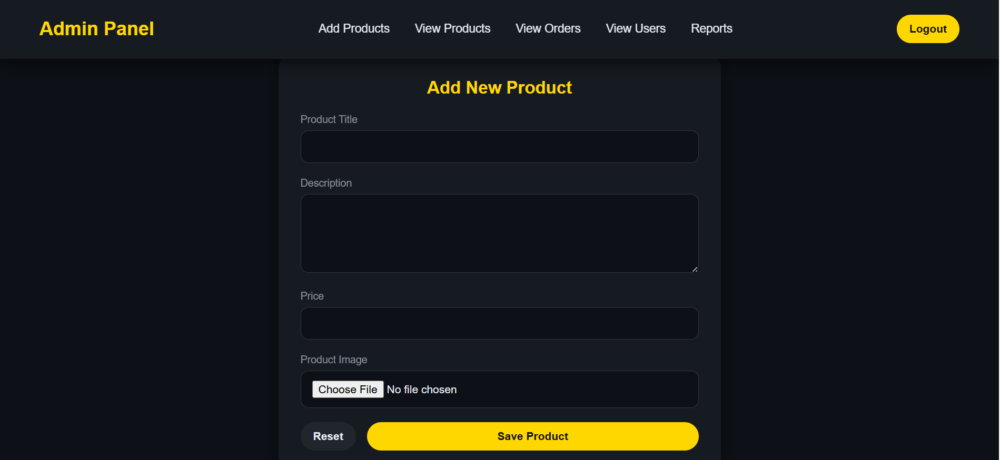

# 👞 Formal Shoes Shop – Django Project

A Django-based web application for managing a formal shoes shop using MySQL database.

---

## 🚀 Features
- Add, update, delete shoes
- Product listing
- User authentication
- Django Admin Panel
- CRUD operations
- MySQL database integration

---

## 🛠️ Tech Stack
- Python
- Django
- MySQL
- HTML, CSS
- Git & GitHub

---
## 📸 Project Screenshots

### login Page


### 🏠 Home Page


### 🛒 Shop Page


### 🛍 Cart Page


### ⚙ Admin Panel



## ▶️ Run Locally
```bash
git clone https://github.com/sujalsolanki1718/Formal-Shoes.git
cd projectone
pip install -r requirements.txt
python manage.py migrate
python manage.py runserver
